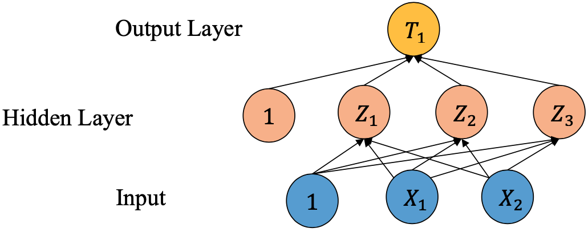

# Go Sandbox

```golang
	go run auctionSimulation.go
```

Simulates a concurrent auction of real estate properties using golang channels. Seven buyers compete to bid on three different properties, and there is no fixed outcome. The program terminates when there are no more active buyers or when all properties have been bought. 

```golang
	go run neuralNet.go
```

Simulates a 3-layer neural network based on the neuron equations provided. Each neuron is fed values from the preceding layer's neurones to compute a new value.



The neuron equations are as follows:
𝜎(v) = 1/(1+pow(e, -v)) where e = 2.71828

𝑍1 = 𝜎(𝛼10 + 𝛼11𝑋1 + 𝑎12𝑋2) 
𝑍2 = 𝜎(𝛼20 + 𝛼21𝑋1 + 𝑎22𝑋2) 
𝑍3 = 𝜎(𝛼30 + 𝛼31𝑋1 + 𝑎32𝑋2) 

𝑇1 = 𝜎(𝛽10 + 𝛽11𝑍1 + 𝛽12𝑍2 + 𝛽13𝑍3)

𝛼10, (...), 𝛼32, 𝛽10, (...), 𝛽13 are provided fixed values

The values of X1 and X2 are set to `sin(2𝜋𝑘/N)` and `cos(2𝜋𝑘/N)`, where N is a number specified by the user. 

```golang
	go run theatre.go
```
A program that manages the sale of tickets in a theatre. Users can select the type of show to watch and their seating arrangement. 

## `Basics`
Content used as a GoLang refresher. 