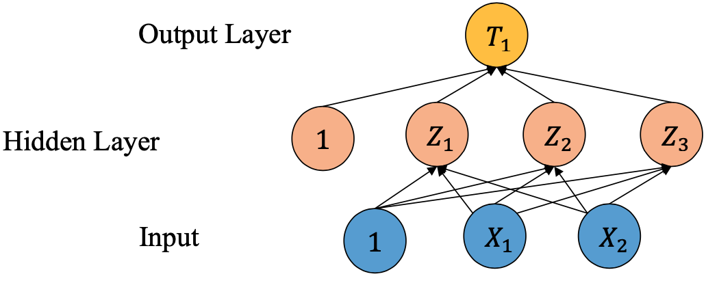

# Lisp (Scheme)

A few practice files of common problems implemented in Scheme. 

### `neuralNet.pl`
* Simulates a 3-layer neural network based on the neuron equations provided. Each neuron is fed values from the preceding layer's neurones to compute a new value.



The neuron equations are as follows:
* 𝑍1 = 𝜎(𝛼10 + 𝛼11𝑋1 + 𝑎12𝑋2) 
* 𝑍2 = 𝜎(𝛼20 + 𝛼21𝑋1 + 𝑎22𝑋2) 
* 𝑍3 = 𝜎(𝛼30 + 𝛼31𝑋1 + 𝑎32𝑋2) 
* 𝑇1 = 𝜎(𝛽10 + 𝛽11𝑍1 + 𝛽12𝑍2 + 𝛽13𝑍3)

𝛼10, 𝛼11, (...), 𝛼32 are all fixed values provided.

The values of X1 and X2 can be provided as input, or left to be set to `sin(2𝜋𝑘/N)` and `cos(2𝜋𝑘/N)`, where N is a number specified by the user. 

#### Examples 
1) Generates T1 based on X1 = X2 = 0.5
```
(neuralNet '(0.5 0.5)) 
==> '(0.782503850784443)
```
2) Generates 16 different values of T1 based on N=16 
```
(applyNet 16)
```

### `vacationRank.pl`
* Given a list of vacation preferences for a list of friends, display the vacation locations in order of overall preferability. 

#### Example
```
(destination choices)
==> '(("peru" . 13) ("greece" . 13))
```

### `raffle.pl`
* Given a list of people, pull N random names from the list and display them

#### Example 
```
(winner names 3)
==> ("claude" "jean" "eve")

(winner names 3)
==> ("tom" "sam" "jean")

(winner names 2)
==> ("eve" "jean")
```

